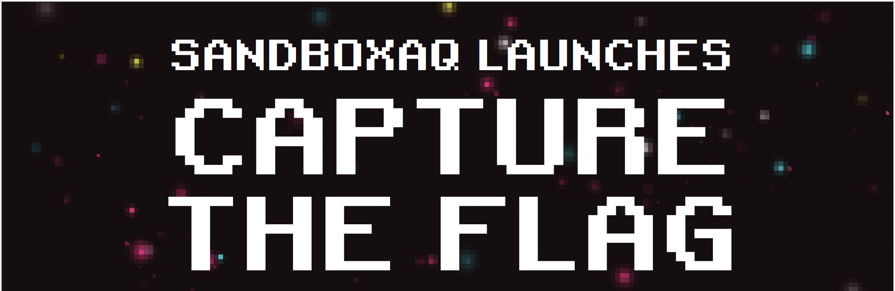
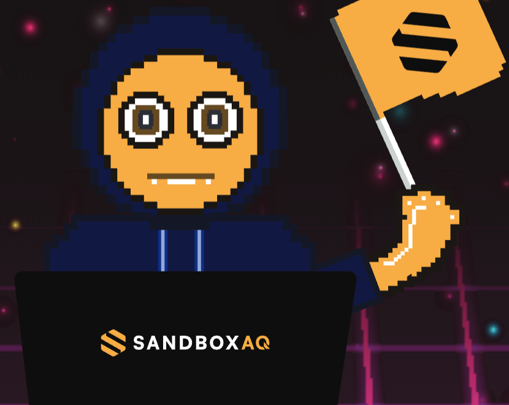

# SandboxAQ Capture the Flag - February/March 2024

Join us for an exciting opportunity to showcase your expertise in cryptography and cybersecurity. SandboxAQ is an enterprise SaaS company providing solutions at the nexus of AI and Quantum technology (AQ). We want to celebrate top talent like yours and showcase our cutting-edge information protection technologies and advanced cryptography methods. Get ready to take on a series of challenges that will put your technical skills to the test.

## Dates

__Start:__ Tuesday 27 February 2024 - 09:00 p.m PT

__End:__ Tuesday 19 March 2024 - 23:59 p.m PT

Winners will be announced on March 24, 2024 at the [RWPQC](https://rwpqc.org) conference.

## Rewards and acknowledgement

Prizes will be awarded to the top three entries.

| Rank | Prize |
|------|-------|
| 1st  |  Microsoft Xbox Series X Console |
| 2nd  | YubiKey C Bio - FIDO Edition  |
| 3rd  | Nitrokey 3C NFC   |

Winning solutions will be showcased in the repository, and winners will have the opportunity to share their insights and experiences with the cybersecurity community in a featured post on the SandboxAQ blog.

## Eligibility

- You must be at least 18 years old to be eligible for participation.
- Awards will only be distributed to residents of North/South America, Europe, and Australia due to logistical reasons.

## Rules

- Participation is open to individuals only. 
- Challenge details are available in the linked repository (see the Challenges section below). 
- Send your solution to ctf-rwpqc2024@sandboxaq.com.
- Each challenge submission will be assigned a score. The participant with the highest score will be declared the winner.
- In case of participants having the same score, the winner will be the one who submits their solutions first.
- SandboxAQ reserves the right to cancel participation or discard solutions if misuse or manipulation is detected.

## Submission Agreement

By submitting your response, you agree to the following:

- You grant SandboxAQ an unlimited, irrevocable, perpetual, fully paid-up, royalty-free, transferable, sublicensable, worldwide license to use your submission and any content contained therein.

- You confirm that your submission is your original work and does not contain any proprietary or confidential information, whether your own or that of a third party.

## Challenges

[Challenge 1 - Degrees of polynomials in post-quantum cryptography. Breaking baby Kyber](https://github.com/sandbox-quantum/experimental-amunoz/blob/main/CTFSandboxAQ/challenges/challenge1.md) 25 points

[Challenge 2 - Attack on Trained Logistic Regression Model](https://github.com/sandbox-quantum/experimental-amunoz/blob/main/CTFSandboxAQ/challenges/challenge2.md) 20 points

[Challenge 3 - Breaking a real PQC implementations. How to be a crypto analyst](https://github.com/sandbox-quantum/experimental-amunoz/blob/main/CTFSandboxAQ/challenges/challenge3.md) 35 points

[Challenge 4 - Dancing by Xyber](https://github.com/sandbox-quantum/experimental-amunoz/blob/main/CTFSandboxAQ/challenges/challenge4.md) 20 points

## FAQ and questions

For questions regarding the competition, join us on Discord at [RWPQC.org](https://discord.gg/vbTcgV7xQt), #CTF channel.

